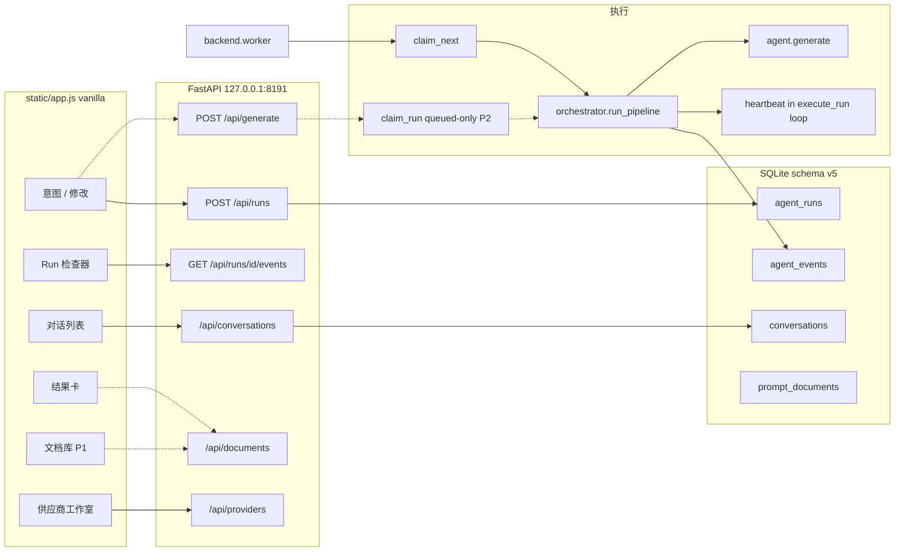
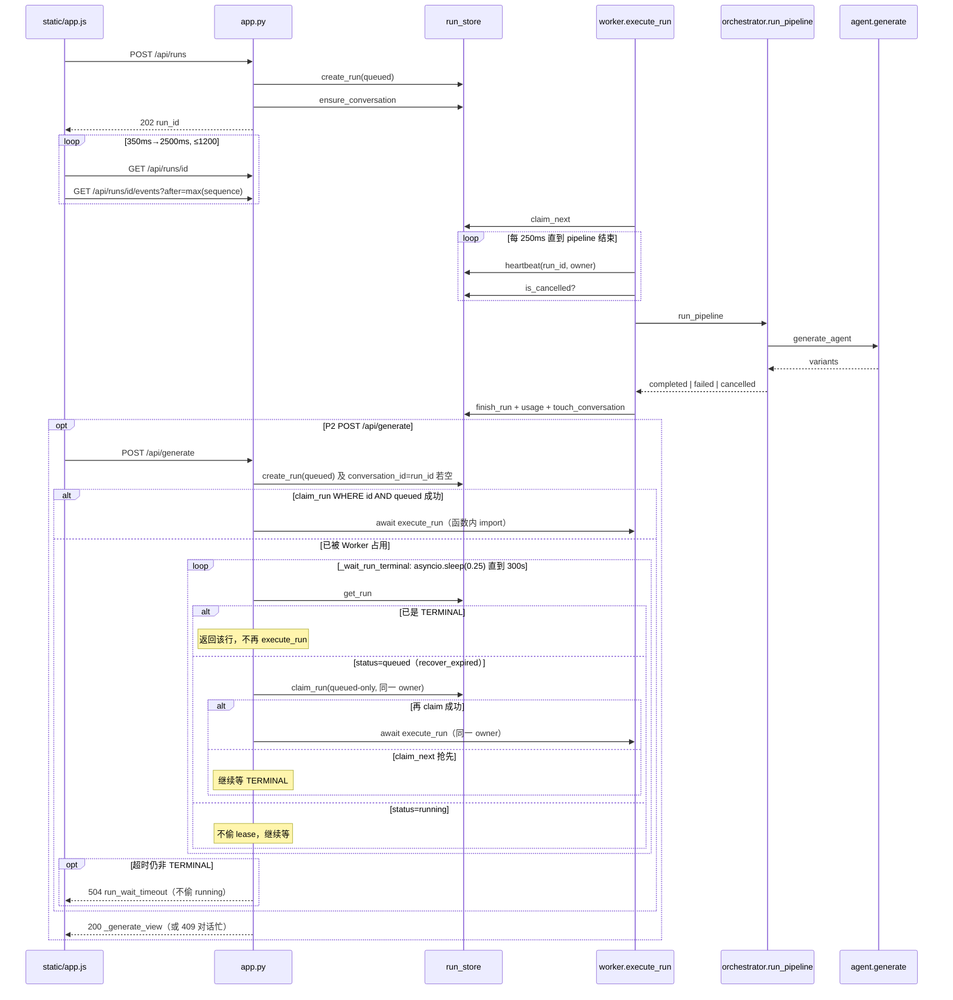

# Anima Agent Prompt Studio v7：Prompt Workbench

| 字段 | 值 |
|---|---|
| **文档标题** | Anima Agent Prompt Studio v7 — Prompt Workbench |
| **作者** | Anima Prompt Studio maintainers |
| **日期** | 2026-08-28 |
| **状态** | Accepted（user decisions incorporated，2026-08-28） |
| **当前分支** | `codex/v6` |
| **目标产品版本** | `7.0.0`（对外文案：v7；**最后一枚 PR 才改 FastAPI / UI chrome**） |
| **当前 FastAPI `version`** | `"1.0.0"`（`backend/app.py`） |
| **当前 `SCHEMA_VERSION`** | `4`（`backend/db.py`） |
| **目标 schema** | `5`（只追加，不重建运行历史） |
| **Must-ship 切片** | P0：对话卫生 + Run 检查器（现有 events）+ 供应商工作室 |

---

## Overview

v6 已经把「可恢复的本地 Run 队列 + Planner→Generator→Validator/Repair→Finalizer 流水线 + 完整文档/供应商 API」做进后端，但 UI 仍是一个只能复制结果的薄聊天页。`POST /api/generate` 绕过 `orchestrator.run_pipeline`；Worker 完成态 `usage` 经常是 `{}`；`agent_events` 已落库但 `waitForRun` 从不拉 `GET /api/runs/{id}/events`。供应商页只用 `PUT /api/providers/{id}` 做启停，新增/导入/测通/同步模型没有入口。

v7 **Prompt Workbench** 不换栈。它把已经存在的耐久后端接到工作台上，但 **不把「文档库 + 生成路径统一 + 对话删除」绑成一个不可拆的版本**。Token 芯片编辑 **不在 v7**（用户已拍板延后）。

**Must-ship（P0，可独立合进 `codex/v6`，用户立刻能用；范围不因产品问答而扩大）：**

1. Schema v5 + 对话可搜索、重命名、置顶、加载超过 20 条（P0 **仍无**删除按钮；硬删在 PR11）。
2. Run 检查器：消费 **现有** `POST /api/runs` 写入的 events，不依赖 `/api/generate` 统一。
3. 供应商工作室：新增 / 编辑 / 导入 / 测通 / 同步 / `max_tokens` / `timeout`（这是当前无法在 UI 建连接的阻塞点）。
4. Worker 执行期间 heartbeat（修 v6 已有的 45s lease 过期可被 `claim_next` 抢走的 bug）+ Worker `usage` 组装。

**Should-ship（P1，v7 范围内）：** 文档库——显式「保存为文档」（从不自动保存）/ 「保存全部候选」/ 导出 / 版本 / 文档 DELETE + `POST /api/documents/lint` + **「从文档恢复为修改基线」**。结果卡保持 copy-only（无芯片编辑）。

**Parked（P2，仍属 v7 里程碑、不挡 P0 打标签）：** `/api/generate` 与 Worker 统一到 `execute_run`（必须先有 heartbeat）；相似候选 last-round 软化；Skills `explain_activation`；**对话硬删除（PR11，已拍板）**。Token 芯片编辑与芯片 UI **移出 v7**。Locked-token 校验器 **不挡 P0/P1**；若后续对「带 `locked: true` 的已恢复文档」做 modify，可再加，不作为 v7 必做。

产品版本 `7.0.0` 与侧栏标题 **在 P0 合入之后、最后一枚 PR 才改**，避免出现「version 已是 v7、UI 仍是 copy-only 聊天框」。

本版本仍是 **127.0.0.1:8191 上的单用户、SQLite、无账号** 本地工作区。成人 Anima 提示词是产品域内需求；禁词与数量档位继续以 `backend/banlist.py` 与 `backend/documents.py` 为唯一真源。

---

## Background & Motivation

### 产品今天实际在做什么

启动入口仍是 `run.ps1` / `start-workbench.ps1` / `launcher/Program.cs`：本机拉起 `uvicorn backend.app:app --host 127.0.0.1 --port 8191` 和 `python -m backend.worker`。数据在 `data/workbench.sqlite3`。README 写明：升到 schema v4 **只重建运行历史**，不删文档、供应商、设置或密钥引用。

用户路径（`static/app.js` → `generate()`）：

1. 中文意图进 `#intentInput`。
2. `POST /api/runs`（202）→ `waitForRun()` 最多 1200 次轮询 **仅** `GET /api/runs/{id}`，backoff 350ms→2500ms。成功时返回 `run.result`（内层 `response_json`，顶层带 `variants` / `conversation_id`）。
3. 成功后结果卡只渲染 `serialize(positive_tokens)` + 可选中文对照，按钮只有「复制」。
4. 若当前对话已有结果，下一次提交走 `mode: "modify"`，`current_document` 只带 `{ original_intent, variants }`（内存里的 `state.variants`，不是 drafts）。
5. 侧栏用 `GET /api/workspace?limit=20` 的 `recent_runs` 按 `conversation_id` 分组；`loadRuns` 再打 `/api/agent-runs?limit=20`。标题就是 `intent`；无搜索、无重命名、无删除、无分页。超过 20 条对话刷新后从侧栏消失（行还在 `agent_runs`）。

Agent 契约未变（`backend/persona.py` `STUDIO_PERSONA` + `backend/agent.py` `DEFAULT_SYSTEM_PROMPT`）：只返回正面 Token JSON；自定义系统提示词 **prepend** 到人格前面；核心 Skills 始终注入；`deepseek-unrestricted` 默认关且 `allow_implicit_invocation: false`。

### 已核实的缺口（相对「观察列表」）

下列全部对照过 `F:\prompt repository`（FastAPI `1.0.0`，schema 4），保留为 v7 输入。

| 缺口 | 证据 | 影响 |
|---|---|---|
| 文档 CRUD 未进 UI | `GET/POST/PATCH /api/documents*`、`versions` / `restore` / `validate` / `export` 齐全（`backend/app.py`）；`static/app.js` **零** `/api/documents` 调用。结果卡 copy-only。 | 用户无法把候选沉淀为可版本化文档。P1 再接，不挡 P0。 |
| 供应商 UI 只有启停 | `renderProviders()` 只渲染 toggle。**启停已经走 `PUT /api/providers/{id}`**（`toggleProvider` 会把 `name/base_url/model/env_name/max_tokens/timeout/enabled` 原样写回，不带 `api_key`）。**未使用的是** `POST /api/providers`、`POST /api/providers/import`、`POST .../test`、`POST .../models/sync`、以及带新密钥的 PUT。README 承认「精简界面不提供新增入口」。`_provider_view()` 只暴露 `has_api_key` / `env_name`，GET 从不含 `api_key`。 | 没有外部工具就无法在 UI 里 **新建** 连接。这是 P0。 |
| 事件 / trace 未展示 | `GET /api/runs/{id}/events`、`GET /api/agent-runs/{id}/trace` 有测试（`test_run_events_are_incremental`、`test_agent_tool_loop_persists_trace_and_exposes_tools`）。`waitForRun` 只读 `status/stage/progress`。Worker 路径已经 `append_event` stage。 | 长任务只有「queued · 10%」。检查器可以 **只靠现有 `/api/runs` 事件** 上线，不必先统一 generate。 |
| 双生成路径 | UI → `POST /api/runs` → `worker.execute_run` → `orchestrator.run_pipeline`。`POST /api/generate` 直接 `await generate_agent(...)`，自己 `INSERT INTO agent_runs`（不填 stage/lease/usage_json），**全仓库只有 `worker.py` 调用 `run_pipeline`**。大量测试打在 `/api/generate`。 | 兼容接口跳过 orchestrator 二次 repair 与 stage 事件。统一是 P2，且会触发测试海啸（fake variant 不过 `validate_variant`）。 |
| Worker `usage` 丢失 | `worker.py` `finish_run(..., usage=result.get("usage") or {})`，但 `agent.generate` / `run_pipeline` 把 `input_tokens` / `output_tokens` 放在 **顶层**。`/api/generate` 自己组装了正确的 `usage` 对象——这是 **Worker-only** bug。 | 检查器读 `GET /api/runs/{id}` 的 `usage` 经常是 `{}`。可在 P0 与 heartbeat 一起修，不必统一 generate。 |
| 对话 UX 薄 | 无 `conversations` 表；client-side groupBy `agent_runs.conversation_id`。 | P0：新表 + 列表 API + 侧栏。 |
| 修改基线不完整 | `TokenIn.locked` / `documents.token_dict` 已持久化；UI 不暴露芯片。`validate_variant` 只用 `locked` 做保护词译文相等。 | v7 用文档库「从文档恢复为修改基线」把已存 token（含 `locked`/`weight`）原样送进 `current_document.variants`。不建芯片 UI。 |
| Repair 很重 | `orchestrator.run_pipeline` 失败后整段 `generate_agent(..., repair_note=...)`。`agent.generate` 内部最多 16 轮。 | 不换架构。结构化 `issues` 随 P1 lint / P2 统一带上。 |
| Skill 匹配不透明 | `skill_runtime.matching_triggers()` **已定义、无调用方**。真实注入是 `skills.build_skill_state` / `selected()`（core + `$name` + trigger + `__variation_dimensions` + `depends_on` − disabled non-core）。`GET /api/skills` 已返回 `triggers` / `core` / `diagnostics`，`renderSkills()` 只用 description + toggle。 | 解释器必须包在 `build_skill_state` 上，不能另写一套 matcher。P2 或随 Skills 小 PR。 |
| 版本号分裂 | FastAPI `"1.0.0"`，schema v4，标题「Agent Studio」，`app.js?v=20260827-4`。Launcher 只要求 `/api/status` HTTP 200。 | 最后一枚 PR 再改 `PRODUCT_VERSION`，避免 CI 把「假 v7」锁死。 |
| **Lease 在执行期间不续约（v6 已有 bug）** | `LEASE_SECONDS = 45`（`run_store.py`），`AGENT_TIMEOUT_SECONDS = 300`（`agent.py`）。`execute_run` 的 250ms 循环只检查 cancel，**不** `heartbeat`。`run_loop` 在 `execute_run` **返回之后** 才 `heartbeat()`，而此时 `finish_run` 已清空 lease，且 `heartbeat()` 要求 `status='running'`。`claim_next` 会抢走 `status='running' AND lease_expires_at < now()`。 | 超过 45s 的模型调用可被第二个 `execute_run` 并发；last `finish_run` 赢，用户双计费。P0 必须修；统一 generate 之前必须修。 |

### 明确不是缺口 / 不要在 v7 重做

- `recover_expired`（attempt&lt;3 回 queued，≥3 失败）和 `worker.lock`（`msvcrt` 单 Worker）已经存在。**缺的是执行中的 heartbeat**，不是整套 lease 模型。
- `negative_tokens` 列保留但不迁移；生成路径 `validate_variant` 会 `pop("negative_tokens")`。不要复活负面提示词。
- 核心 Skill 文件、槽位顺序、Anima 语法、数量档位数字（simple 16–30 / standard 22–38 / complex 30–48）保持不动。
- 单用户、无鉴权、SQLite、vanilla `static/app.js` 是约束，不是债。
- `backend/workflow.py` 只有 pyc 残留，不恢复该模块。

### 痛点一句话

**后端已经是工作台，前端还是聊天框。** v7 P0 把对话、检查器、供应商接到用户手上；P1 用文档库 + 恢复为修改基线补上「认领成品」路径；生成路径统一与对话硬删放在 P2 PR，不挡 P0。Token 芯片不在本版本。

---

## Goals & Non-Goals

### Must-ship — P0（合入即可称为可用的 Prompt Workbench）

1. **对话卫生：** 搜索、重命名、置顶、offset 分页加载超过 20 条。P0 **不**放删除按钮（硬删在 PR11）。
2. **Run 检查器：** 阶段时间线、工具调用、usage/latency；进度文案按 stage 变化。数据来自 **现有** `GET /api/runs/{id}/events?after=`（Worker 已写 stage）。保留 status 轮询；不上 SSE。
3. **供应商工作室：** UI 新增 / 编辑 / 删除 / JSON 导入 / 测通 / 同步模型 / `max_tokens` / `timeout`；保存后不回显密钥。
4. **Worker 正确性：** `execute_run` 循环内 heartbeat；`finish_run` 的 `usage` = `{latency_ms, input_tokens, output_tokens}`。
5. **Schema v5：** `conversations` 表 + 文档 provenance 列；**所有** `prompt_documents` 写路径改为具名列 INSERT/UPDATE。

### Should-ship — P1（v7 范围内）

6. **文档库（显式保存，从不自动）：** 结果卡「保存为文档」「保存全部候选」「导出」；文档列表、版本恢复、`DELETE /api/documents/{id}`；`POST /api/documents/lint`。
7. **从文档恢复为修改基线：** 把已保存文档的 `positive_tokens`（含已有 `locked`/`weight`）原样写入 `current_document.variants`，作为下一次 `mode=modify` 的基线。这是芯片延期后的用户可见替代能力。
8. **Lint 可见（文档路径）：** 结果卡用 lint 显示档位与 warning；**生成路径仍硬失败数量/禁词**（不改 `_count_band`）。

### Parked — P2（v7 里程碑内，不挡 P0 打标签）

9. **单一生成流水线：** `POST /api/generate` 走 `claim_run` + `execute_run`。必须在 heartbeat 与测试夹具之后。见兼容性 delta。
10. **相似候选 last-round 软化** 与 Skills 页 `explain_activation`（包在 `build_skill_state` 上）。
11. **对话硬删除（PR11，已拍板）：** `DELETE conversations` + 该 `conversation_id` 的 `agent_runs`（`agent_events` CASCADE）。已保存文档保留。不可撤销。README 写升级/删除前备份。
12. **版本 chrome：** `PRODUCT_VERSION = "7.0.0"`、窗口标题、托盘文案——**最后一枚 PR**。

### 明确移出 v7

- **Token 芯片编辑 UI**（增删改序、锁定、权重步进、DnD）。结果卡保持 copy-only。
- **Locked-token 校验器**不作为 v7 必做、不挡 P0/P1。恢复为修改基线时 token **原样**发送；若日后对带 `locked: true` 的文档做 modify，可再启用 Key Decision 11 的校验。

### Non-Goals

- 多用户、远程托管、登录鉴权。
- 换掉 SQLite，或把 schema v4→v5 做成「再重建一遍 `agent_runs`」。
- 恢复负面提示词生成。
- 替换 Planner 架构 / 非 `tools`/`tool_calls` 协议。
- 工作台内图像生成 / 预览。
- 前端重写成 React/Vue；SSE/WebSocket。
- 改 Anima 标签语法、槽位顺序、或核心 Skill 正文（UI 只展示已有 frontmatter，例如 `triggers`）。
- Playwright 作为 CI 必跑项。
- `settings.runtime` 里加 `ui_inspector` / `ui_token_editor`：`_runtime_settings` 的 allowlist 是 `requested_count, include_chinese, system_prompt, provider_id, model, reasoning_effort, skill_mode, skills`，未扩展的键会被静默丢掉。用 PR 顺序代替 flag。
- Token 芯片编辑器（用户已决定延后，不在 v7）。

### 成功标准

**P0（在 chrome PR 之前即可验证，不锁 `version == "7.0.0"`）：**

- `GET /api/status` 的 `schema_version == 5`；表集合含 `conversations`；预置的 v4 `agent_runs` / `prompt_documents` 行仍在。
- `POST /api/documents` 在 12 列的表上仍成功（具名 INSERT）。
- 侧栏走 `GET /api/conversations`，不再 groupBy `recent_runs`；搜索 / 改名 / 置顶 / load-more 可用。
- `waitForRun` 至少请求一次 `events?after=`；`after` 取 max `sequence`。
- 供应商表单保存后 GET 仍无 `api_key`；空 `api_key` 的 PUT 仍能 `_provider_secret`。
- fake generate 持续 &gt; `LEASE_SECONDS` 时，`claim_next` 不能对同一 `run_id` 再开一条 pipeline。

**P1 额外：** 结果卡显式「保存为文档」不自动落库；「从文档恢复为修改基线」后下一次 modify 的 `current_document.variants[0].positive_tokens` 与文档一致（含 `locked`/`weight`）。

**P2 额外：** `/api/generate` JSON 键快照与统一前一致（见兼容性表）；无供应商时仍 **200** + `provider_unavailable`（不是 409）。硬删对话后 runs/events 消失、同 `conversation_id` 的 `prompt_documents` 仍在。

---

## Key Decisions

实现默认值。Q1–Q3 已由用户拍板（见下「User decisions」）；PR 作者按此实现，不再讨论。

### User decisions（2026-08-28，最终）

U1. **对话删除 = 硬删除。** `DELETE` `conversations` 行 + 该 `conversation_id` 下全部 `agent_runs`（`agent_events` 已有 `ON DELETE CASCADE`）。**已保存的 `prompt_documents` 不删。** 不可撤销。README 必须写：删除或升级前备份 `data/workbench.sqlite3`。删除按钮在 **PR11** 交付（P2 顺序，不再等产品问答）。未保存的内存结果随 runs 消失（与 Decision 15 一致）。

U2. **文档只显式保存，生成成功从不自动写入 `prompt_documents`。** 结果卡「保存为文档」；允许多候选时「保存全部候选」。Modify 使用内存里上次生成的 `state.variants`，或用户从文档库「从文档恢复为修改基线」后的那份 token。P1 文档库 **要做**。

U3. **Token 芯片不在 v7。** 结果卡保持 copy-only，不做增删改序/锁定/权重 UI。替代的用户可见能力：P1 文档库 +「从文档恢复为修改基线」（把文档 `positive_tokens` 原样放进 `current_document.variants`，包括已有 `locked`/`weight`）。原 PR8（芯片 UI）**取消**。Locked-token 校验器不挡 P0/P1；v7 不实现芯片编辑器。

1. **继续 HTTP 轮询，不上 SSE/WebSocket。** `list_events(run_id, after=)` 已是 cursor。检查器与 `waitForRun` 同循环拉 events。回滚 = 停掉 events 请求。

2. **Schema 升到 v5，只追加，不 DROP `agent_runs` / `agent_events`。** `existing_version < 4` 才重建运行历史。v5 新增 `conversations`，`prompt_documents` ALTER 两列。不给 `agent_runs.conversation_id` 加 SQLite FK。级联由应用层完成。

3. **`prompt_documents` 的每一处写路径改为具名列。** 今天 `create_document` 是 `INSERT INTO prompt_documents VALUES(?,?,?,?,?,?,?,?,?,?)`（10 个值，`backend/app.py`）。ALTER 两列后该语句会失败。`DocumentIn` / `canonical_document` / `document_view` / `write_document` / `snapshot` 同步接受 `conversation_id`、`variant_index`。`prompt_versions` 的 `INSERT INTO prompt_versions VALUES(...)` 列数未变，可保留或一并具名。

4. **回滚诚实说明：** 把代码退回 v6、数据库留在 v5 **不能安全写文档**。必须恢复 `data/backups/pre-v5-*.sqlite3`（或升级前手工拷贝）。读取 runs/providers/旧文档行仍然可以，因为 SELECT * + `document_view` 多列只是多字段。禁止写 `DROP TABLE conversations` 降级路径。

5. **对话生命周期有写路径，不只 backfill。** `backend/conversations.py`（new）提供 `ensure_conversation(id, title, title_source="intent")` 与 `touch_conversation(id)`。`create_run` 在插入 `agent_runs` 之后 `ensure_conversation`（空 `conversation_id` 已在 `_prepare_run_body` 变成 UUID 或 generate 的 `run_id`）。`finish_run` 调用 `touch_conversation` 以把 modify 顶到列表顶部。仅靠 `_create_schema` 的一次性 backfill 不够。

6. **P0 不统一 `/api/generate`。** UI 从不调用它。统一是 P2，且必须先有决策 7。

7. **Lease 在 `execute_run` 生命周期内独占（P0 修 bug；P2 统一依赖它）。**
   - `LEASE_SECONDS = 45` 保持给 **queued 抢占**；活着的 owner 必须续约。
   - 在 `execute_run` 现有 `while not pipeline_task.done(): ... await asyncio.sleep(0.25)` 循环里，每次迭代调用 `heartbeat(run_id, owner)`（claim 时的同一 `owner` 字符串）。这同时修 v6 Worker。
   - **`claim_run(run_id, owner)` 只抢 `WHERE id=? AND status='queued'`**，**绝不** 抢 `running`（即使 lease 过期）。过期 running 仍只由 `claim_next` / `recover_expired` 处理——同步 generate 不得偷 Worker 的活。
   - 内联 claim 成功后把该行的 `lease_expires_at` 初次设为 `now + AGENT_TIMEOUT_SECONDS`（300s），之后仍 250ms heartbeat。理由：HTTP 请求本身就是 owner，初始租约应覆盖整次 agent 预算；heartbeat 是双保险。
   - `create_run` 与 `claim_run` 仍是两次 `BEGIN IMMEDIATE`。若 Worker 先 `claim_next` 拿走：`claim_run` 返回空，generate **不得** 立刻再执行 pipeline，转入 `_wait_run_terminal`。
   - **Wait-for-TERMINAL（仅 P2 generate）—— `_wait_run_terminal(run_id, owner)` 必须自己跑 pipeline，不能只 claim。** 规格：
     1. 循环：`await asyncio.sleep(0.25)`（禁止 `time.sleep`），上限 `AGENT_TIMEOUT_SECONDS`。
     2. `row = get_run(run_id)`。
     3. **TERMINAL**（`completed` / `failed` / `cancelled`）→ 返回该行，**不**再 `execute_run`。
     4. **`status == 'queued'`**（典型：Worker 崩溃后 `recover_expired`）→ `claimed = claim_run(run_id, owner)`（同一 `sync:…` owner）：
        - 成功 → **`await execute_run(claimed, owner=owner)`**，然后返回 `get_run(run_id)`。漏掉这一步会把行标成 `running`、300s 租约挂在 HTTP 进程上，却没有执行器。
        - 失败（`claim_next` 抢先）→ 继续循环等 TERMINAL。
     5. **`status == 'running'`**（他人有效 lease）→ 继续等，**不** steal。
     6. 300s 后仍非 TERMINAL → HTTP **504** `{ "code": "run_wait_timeout", "run_id", "status", "stage" }`，不把 `running` 改成自己的。
   - `generate()` **函数体内** `from .worker import execute_run`，避免 `app` ↔ `worker` 循环导入（`worker.py` 已有 `from . import app`）。
   - 测试：（a）fake `generate` 睡 &gt; 45s；期间反复 `claim_next`；同一 `run_id` 只有一次 pipeline。（b）P2：Worker 已 `claim_next`；等待中模拟 `recover_expired` 把该行打回 `queued`；generate 的 `_wait_run_terminal` 再 claim 并 `execute_run`；断言 **恰好一次** `execute_run`（Worker 那次已失败/被回收，HTTP 这次完成）且 `_generate_view` 为 completed。

8. **`/api/generate` 兼容性（P2 才生效）—— writer 已定，不阻塞 P0：**
   - 无供应商：保持 **200** + `status=failed` + `error.code=provider_unavailable`（`execute_run` 已如此；不要改成 409）。
   - 对话已有 queued/running：改为 **409**，detail 用 `create_run` 现有字符串 `conversation already has an active run`（今天 generate 的裸 INSERT 不检查）。
   - `conversation_id`：generate 的 create 路径保持今天语义 **`body.conversation_id or run_id`**（常出现 `id == conversation_id`）。`POST /api/runs` 仍用 `_prepare_run_body` 的 `uuid.uuid4()`。两条入口可以不同。
   - `idempotency_key`：统一后走 `create_run` 查找；同一 key 返回已有行（今天 generate 忽略该字段并总是 INSERT）。这是更安全的行为，写入兼容性表并改相关测试。
   - `_generate_view(stored)` 把 `response_json` 摊平到顶层，并用 `usage_json` 填 `usage`，使 generate 顶层 `usage` 与 `GET /api/runs/{id}.usage` 一致。
   - 统一后 generate **会** 写 stage 事件（今天只插 `tool_trace` 行）。契约测试锁键名，不锁「零 stage」。

9. **完成态 `usage` 统一为** `{ latency_ms, input_tokens, output_tokens }`。P0 只改 `worker.execute_run`：`usage={"latency_ms": result.get("latency_ms"), "input_tokens": result.get("input_tokens"), "output_tokens": result.get("output_tokens")}`。不改 `/api/generate` 直到 P2。

10. **Lint / 数量 / 相似（档位数字不变）。**
    - `validate_variant` 引入 `ValidationFailed(issues)`（`ValueError` 子类，带 `issues: list[dict]`），取代 `raise ValueError("; ".join(messages))`。orchestrator 按 variant 循环补 `variant_index`，映射到 `error: {code, message, issues}` 写入 `error_json` 与 generate 视图。
    - 数量越界 / 禁词 / 互斥 / 空正面 = **error**，生成路径硬失败。
    - 卡片黄条走 `lint_variant_card(..., enforce_quantity=False)`：数量为 `severity=warning`，**不阻止保存**；若用户此时点生成/modify，后端仍硬失败——卡片文案写明「保存可以，再生成会被拒绝」。
    - **`SOFT_SIMILARITY = True`（原 Q5，现已定）：** `variant_too_similar` 仍在 `agent.generate` 的 16 轮里触发重试；**仅当 `round_index + 1 == MAX_AGENT_ROUNDS`** 才带着 `variant_diagnostics` 以 `status=completed` 返回。orchestrator **不再**为相似硬失败（它今天也看不到该异常，除非改 last-round）。P2 才改 `agent.py`；P0 行为保持 v6 硬失败。

11. **Locked-token 校验器不在 v7 必做、不挡 P0/P1（U3）。** 恢复为修改基线时把文档 token **原样**放进 `current_document.variants`（已有 `locked`/`weight` 一并带上）。v7 **不**实现芯片 UI，也 **不**把 `validate_variant` 的 locked 强制检查列为合并门槛。若后续版本对带 `locked: true` 的恢复文档做 modify，再在 `validate_variant` / orchestrator 检查：凡 `locked: true` 或 `PROTECTED_RE` 匹配的 token 必须在对应输出 variant 中原文出现且相对顺序不变（`locked_token_dropped` / `locked_token_reordered`）。保留现有 modify 系统句（「Apply only the user's modification_request; preserve unspecified tokens」）即可。

12. **`explain_activation` 不是第二套 matcher。** 纯函数：`parse_generation_request(intent)` → `build_skill_state(...)` → 对 catalog 里每个 id 标 `selection_reason`: `core` / `explicit` / `trigger` / `dimension` / `dependency` / `disabled`。`matched_triggers` 来自已有 `matching_triggers`。`GET /api/skills?intent=` 走这条路径，因此「给我生成5组不同服装」与 generate 一样标上 `clothing-library`（dimension + trigger）。`deepseek-unrestricted` 保持 implicit-off。

13. **Provider PUT 语义（与现有 `update_provider` 对齐，写进契约测试）：**
    - 客户端 **永不** 发送 `secret_ref`。
    - `api_key` 缺省或 `""`：不调用 `put_secret`。
    - `api_key` 非空：`put_secret`；`secret_ref` 沿用已有非 `env:` / 非 `ANIMA_` 引用，否则 `provider-{id}`。
    - `api_key` 为空时：`env_name.strip()` 非空 → `secret_ref = env:{env_name}`；否则 **保留** 行内 `secret_ref`。因此「只改 `max_tokens`、`env_name` 绑成 GET 回来的值或空字符串」不会丢 Credential Manager 里的 key。
    - UI：password 不回填；placeholder「已保存」当 `has_api_key`。导入的原始 JSON **不** `console.log`、不写入 `state.providers`。`state.providers` 只存 `_provider_view`。表单 **没有** uvicorn host 字段（`base_url` 是 OpenAI-compatible API，不是绑定地址）。

14. **Token 芯片不在 v7（U3）。** 不做增删改序/锁定/权重 UI；无 `state.drafts` 芯片缓冲。`generate()` modify 继续发送内存 `state.variants`，或文档恢复后的那份 variants。无新 token 字段。

15. **硬删对话时未保存的生成结果随 runs 消失：可接受（U1 / 原 Q4）。** `prompt_documents` **不**级联删除。P0 侧栏仍无删除按钮；PR11 才加硬删 + 确认框。

16. **`waitForRun` 规范化（P0 检查器即可实现）：**
    - 若 `run.result.variants` 存在（或 `run.result` 为对象），返回 `{...run.result, status: run.status, error: run.error || run.result.error || null, usage: run.usage || run.result.usage || {}, stage: run.stage, progress: run.progress}`。`generate()` 继续读 `result.variants` / `result.conversation_id` / `result.id`。
    - `after = Math.max(after, ...items.map(e => Number(e.sequence) || 0))`；`items` 为空则 `after` 不变。
    - 实时与历史 **只** 用 `GET /api/runs/{id}/events?after=`。不用 `/api/agent-runs/{id}/trace`（`list_events` 已把 `step_id` 映射为 `stage`）。
    - 历史行 `items=[]` 且 `status==='completed'`（旧 `/api/generate` 只有 tool 事件、无 stage）：检查器显示「此记录没有阶段事件（旧版兼容生成）」；variants 仍来自 `run.result`；若 `result.tool_trace` 有内容可只读展示。

17. **产品版本单点，但最后才改。** `PRODUCT_VERSION = "7.0.0"` 在收尾 PR 写入 `FastAPI(..., version=PRODUCT_VERSION)`。此前 CI **不要** 断言 `version == "7.0.0"`。

18. **不使用 runtime feature flags。** 用 PR 顺序：先合后端/检查器/供应商，再合文档，最后 chrome。

---

## Must-ship cut（相对「整包 v7」）

| 切片 | 用户可见？ | 依赖 | 若滑移 |
|---|---|---|---|
| P0 对话 + 检查器 + 供应商 + heartbeat/usage | 是 | schema v5 | **这就是可发布的工作台内核**；范围不因 U1–U3 扩大 |
| P1 文档库 + 显式保存 + 从文档恢复为修改基线 + lint | 是 | schema 列、具名 INSERT | v7 范围内；P0 仍完整 |
| P2 generate 统一 | 否（契约） | heartbeat、合法 fake variants | 可进 v7.1；UI 不受影响 |
| Token 芯片编辑 + locked 校验器 | — | — | **移出 v7**（U3）。替代能力在 P1 |
| P2 对话硬删除（PR11） | 是 | PR3/PR4 | **已拍板硬删**；P0 仍无按钮，PR11 交付 |
| Chrome `7.0.0` | 是 | P0 已合 | 最后再改，避免假版本 |

P0 已经有三项用户可见能力（对话卫生、检查器、供应商工作室）。P1 文档库 +「从文档恢复为修改基线」是芯片延期后的可见替代，不能只交后端重构。

---

## Proposed Design

### 架构（P0 实线 / P2 虚线）



### 生成时序（P0 实线；P2 wait 路径画出）



### 模块职责（沿用，不换栈）

| 模块 | 角色 |
|---|---|
| `backend/app.py` | HTTP。P0：conversations 路由、具名文档 INSERT、`DocumentIn` 新字段。P1：DELETE document、lint、恢复为修改基线的客户端契约。P2：同步 generate + 函数内 import `execute_run`；PR11 硬删对话。收尾：`PRODUCT_VERSION`。 |
| `backend/worker.py` | `execute_run` 循环内 heartbeat；P0 修正 usage 组装。P2 被 generate 调用。 |
| `backend/orchestrator.py` | 流水线。P2：`ValidationFailed` → structured issues。相似不在这一层硬失败。Locked 强制检查不在 v7 必做。 |
| `backend/agent.py` | 模型循环、`validate_variant`。P2：`ValidationFailed`；last-round `SOFT_SIMILARITY`。 |
| `backend/run_store.py` | P0：heartbeat 已被 worker 调用。P2：`claim_run`（queued-only）。`finish_run` → `touch_conversation`。`create_run` → `ensure_conversation`。 |
| `backend/conversations.py`（**new**） | ensure / touch / list / search / rename / pin；PR11 硬删。路由仍挂 `app.py`。 |
| `backend/documents.py` | `canonical_document` 含 provenance；`lint_variant_card()`；issue `severity`。**不改档位数字。** |
| `backend/db.py` | `SCHEMA_VERSION = 5`。窗口函数 backfill。`< 4` 重建门闩不动。 |
| `backend/skills.py` | P2：`explain_activation` 包 `build_skill_state`。 |
| `backend/skill_runtime.py` | 不改匹配算法；`matching_triggers` 由 explain 调用。 |
| `backend/secrets.py` | 不改。 |
| `static/app.js` / `index.html` / `style.css` | P0 工作台 UI。ES module，无打包器。 |
| `tests/test_app.py` / `tests/test_prompt.py` | 契约测试；不引入浏览器 CI。 |

不新增前端框架，不恢复 `backend/workflow.py`。

### 1. 对话卫生（P0）

侧栏：

```
［搜索对话］
＋ 新开对话
最近对话          ［加载更多］
  ★ 置顶…
  普通…
```

每项：标题（内联重命名）、相对时间、结果数/版本数、失败标记。P0 **没有**删除按钮。`innerHTML` 继续走 `escapeHtml`（今天 `renderRuns` 已如此）。

#### 写路径

```python
def ensure_conversation(conversation_id: str, title: str, title_source: str = "intent") -> None:
    # INSERT OR IGNORE；已存在则不覆盖 title_source=user 的标题
    # title = (title or "")[:80]

def touch_conversation(conversation_id: str) -> None:
    # UPDATE conversations SET updated_at=now() WHERE id=?
```

调用点：

- `run_store.create_run`：insert run 成功后 `ensure_conversation(conversation_id, intent[:80], "intent")`。
- `_prepare_run_body` 不必重复 insert；create_run 是单点。
- `run_store.finish_run`：`touch_conversation(run["conversation_id"])`。
- `PATCH` 改名：`title_source='user'`，之后 ensure **不得**用 intent 覆盖。

#### `GET /api/conversations?q=&limit=20&offset=0`

```sql
SELECT c.id, c.title, c.pinned, c.title_source, c.updated_at, c.created_at,
       r.id AS latest_run_id,
       r.status AS latest_status,
       r.revision AS latest_revision,
       r.intent AS latest_intent,
       (SELECT COUNT(*) FROM agent_runs x WHERE x.conversation_id = c.id) AS revision_count
FROM conversations c
LEFT JOIN agent_runs r ON r.id = (
    SELECT id FROM agent_runs
    WHERE conversation_id = c.id
    ORDER BY revision DESC, created_at DESC
    LIMIT 1
)
WHERE c.archived_at = ''
  AND (?1 = '' OR c.title LIKE ?2 OR IFNULL(r.intent,'') LIKE ?2)
ORDER BY c.pinned DESC, c.updated_at DESC
LIMIT ?3 OFFSET ?4;
```

`q` 用 `%q%` 绑定；本地量级，不上 FTS5。`COUNT(*)` 另查或窗口，返回 `total`。

JSON：

```json
{
  "items": [
    {
      "id": "...",
      "title": "雨夜东京街头",
      "title_source": "intent",
      "pinned": false,
      "updated_at": "...",
      "latest_run_id": "...",
      "latest_status": "completed",
      "latest_revision": 3,
      "revision_count": 3,
      "variant_count": 5
    }
  ],
  "total": 42
}
```

`variant_count` 从 latest run 的 `response_json.variants` 长度读取（Python 侧 `json.loads`，不把整份 response 返回给列表）。

`PATCH /api/conversations/{id}` `{title?: str, pinned?: bool}`。

`DELETE /api/conversations/{id}` 在 **PR11**（P2 顺序，已拍板硬删）：应用层 `DELETE FROM agent_runs WHERE conversation_id=?`（`agent_events` CASCADE）然后 `DELETE FROM conversations WHERE id=?`。**不**删 `prompt_documents`。P0/PR4 侧栏 **无**删除按钮。`archived_at` 列仍建（硬删用不到；保留以免将来软删再迁移），列表 `WHERE archived_at = ''` 对硬删后的空表无影响。

#### `GET /api/conversations/{id}/runs`

**不要**默认倾倒每条 revision 的 `request_json` / `response_json`。

```json
{
  "items": [
    {
      "id": "...",
      "revision": 1,
      "status": "completed",
      "created_at": "...",
      "intent": "...",
      "mode": "create",
      "variant_count": 2,
      "error": null
    }
  ]
}
```

`ORDER BY revision ASC`。打开对话：该端点填 `state.runs`；选中某一版再 `GET /api/runs/{id}` 取 variants。版本下拉在仅 1 个版本时仍显示只读「版本 1」。

#### 前端与 workspace 双形状

`GET /api/workspace` **保留** `recent_runs`（默认 20，上限可提到 100）给旧客户端。P0 侧栏 **停止** 对 `recent_runs` 做 groupBy。

今天 `static/app.js` 有三处会把「全局最近 20 条 run」写进 `state.runs`（PR4 **必须**拆掉，否则版本下拉 / `selectRun` 仍吃全量 `response_json`）：

| 调用点 | 现状（v6） | PR4 替换 |
|---|---|---|
| `loadRuns(selectLatest)`（约 L367） | `GET /api/agent-runs?limit=20` → `state.runs = data.items` | **删除函数，或改为空操作并加注释「replaced by refreshConversations / loadConversationRuns」**。禁止再打 `/api/agent-runs` 填侧栏。 |
| `generate()` 成功/失败后的 `await loadRuns(false)`（约 L456） | 用全局 20 条覆盖 `state.runs` | 改为 `await refreshConversations()`（`GET /api/conversations` 填侧栏）+ `await loadConversationRuns(state.activeConversationId)`（`GET /api/conversations/{id}/runs` 填版本列表）。variants 已在手的 `normalizeRun` 结果里，**不要**为了画卡再拉全量 `response_json`。 |
| `#retryRun` 点击里的 `await loadRuns(false)`（约 L589） | 同上 | 与 `generate()` 相同：`refreshConversations` + `loadConversationRuns`；variants 来自这次 `waitForRun`/`normalizeRun`。 |
| `applyWorkspace` / `refreshWorkspace`（约 L287 / L307） | `state.runs = workspace.recent_runs` | **不要**把 `recent_runs` 赋给 `state.runs`。`applyWorkspace` 只更新 `settings` / `providers` / `skills`。侧栏走 conversations 端点。若当前有 `activeConversationId`，再 `loadConversationRuns`。`refreshWorkspace(true)` 的「选最近一条」改为 conversations 列表第一项的 `latest_run_id`，然后 `GET /api/runs/{id}`。 |

约定：

- `state.runs` **只** 表示当前对话的 revision 摘要（slim：id / revision / status / created_at / intent / mode / variant_count / error）。
- 打开对话、点版本、`selectRun(runId)`：先确保 `state.runs` 来自 `GET /api/conversations/{id}/runs`；**variants 只** 从 `GET /api/runs/{id}` 或手头的 `normalizeRun` 结果读取。
- `/api/workspace.recent_runs` 保留给旧客户端 / 诊断，**UI 不赋值到 `state.runs`**。

### 2. Run 检查器（P0，不依赖 generate 统一）

`#runMessage` 下增加 `#runInspector`。

| 区块 | 数据来源 |
|---|---|
| 阶段 | events `event_type=stage`：规划 / 生成 / 校验 / 收尾 |
| 进度 | Worker 已写的 10 / 55 / 80 / 100 |
| 工具 | `event_type=tool_call` |
| 模型轮次 | `event_type=model_request` 的 round |
| Skills | 完成态 `result.selected_skill_ids`（有则显示） |
| 用量 | `run.usage`（P0 usage 修复后非空） |
| 失败 | `run.error` |

```javascript
function normalizeRun(run) {
  const result = run.result && typeof run.result === 'object' ? run.result : {};
  return {
    ...result,
    status: run.status,
    error: run.error || result.error || null,
    usage: (run.usage && Object.keys(run.usage).length ? run.usage : null) || result.usage || {},
    stage: run.stage,
    progress: run.progress,
    id: result.id || run.id || run.run_id,
    conversation_id: result.conversation_id || run.conversation_id,
  };
}

function appendInspectorEvents(items, after) {
  for (const event of items || []) state.inspectorEvents.push(event);
  const seq = (items || []).map((e) => Number(e.sequence) || 0);
  return seq.length ? Math.max(after, ...seq) : after;
}

async function waitForRun(runId) {
  let delay = 350;
  let after = 0;
  const waitStarted = Date.now();
  let workerHintShown = false;
  state.inspectorEvents = [];
  for (let attempt = 0; attempt < 1200; attempt += 1) {
    const run = await api(`/api/runs/${encodeURIComponent(runId)}`, { timeout: 10000 });
    const events = await api(`/api/runs/${encodeURIComponent(runId)}/events?after=${after}`, { timeout: 10000 });
    after = appendInspectorEvents(events.items, after);
    $('#cancelRun').hidden = !['queued', 'running'].includes(run.status);
    $('#retryRun').hidden = !['failed', 'cancelled'].includes(run.status);
    const hasStage = state.inspectorEvents.some((e) => e.event_type === 'stage' || e.stage);
    if (run.status === 'queued' && Date.now() - waitStarted > 5000 && !hasStage) {
      if (!workerHintShown) {
        setRunMessage('本地 Worker 未启动，请运行 run.ps1 或托盘启动器');
        workerHintShown = true;
      }
    } else {
      setRunMessage(formatStage(run.stage, run.progress));
    }
    if (['completed', 'failed', 'cancelled'].includes(run.status)) return normalizeRun(run);
    await new Promise((r) => setTimeout(r, delay));
    delay = Math.min(2500, Math.round(delay * 1.12));
  }
  throw new Error('Run 轮询超时，请稍后从历史记录恢复');
}
```

- 5s 计时器是 **这一次** `waitForRun` 的 `waitStarted`；`retry` 会新开循环，计时重置。不读 `/api/status.queued_runs` 来驱动（避免别人的 queued 干扰）。
- 取消按钮在 queued/running 期间保持可见（含 Worker 提示时）。
- `selectRun` / 打开历史：`events?after=0` 填检查器；空列表 + completed 用上面的旧记录文案。

文案：`queued` 已排队，等待本地 Worker；`planner` 正在解析意图与 Skills；`generator` 正在调用模型；`validator` 正在校验数量档位与禁词；`finalizer` 正在整理候选。

### 3. 供应商工作室（P0）

替换 `renderProviders()` 的「一行名字 + toggle」。每张卡片：名称、`base_url`（模型 API，**不是** uvicorn 绑定）、默认模型、`max_tokens`（默认 4096）、`timeout`（默认 120）、`temperature`、启用开关、API key password、`env_name`、保存 / 测通 / 同步 / 删除。

页顶：新增表单 + 「导入 JSON」（`POST /api/providers/import`，1–50 条）。File input 读文本 → `JSON.parse` → POST；catch 后 toast；**不**把 raw 存进 `state`、不 `console.log`。

保存 PUT 体：

```json
{
  "name": "...",
  "base_url": "https://api.example/v1",
  "model": "...",
  "api_key": "",
  "env_name": "",
  "temperature": 0.7,
  "max_tokens": 4096,
  "timeout": 120,
  "enabled": true
}
```

`api_key` 仅当用户输入新密钥时非空。`env_name` 回填 GET 的 `env_name`（Credential Manager 项通常为 `""`）。语义见 Key Decision 13。

测通失败显示接口返回的 `error` 字符串。同步后刷新 `routeModel`（`providerModels()` 已读 `provider.models`）。

不展示 `secret_ref`。不把 host/bind 与 `base_url` 混在一个字段。

### 4. 文档库（P1，显式保存 + 恢复为修改基线）

结果卡 **copy-only**（复制英文 / 复制中文），另加：

- **保存为文档** — 只保存这一张候选；`POST /api/documents`。生成成功 **从不**自动调用。
- **保存全部候选** — 对 `state.variants` 逐张 `POST`（可选，多候选时显示）。
- **导出** — 现有 `POST /api/documents/{id}/export` 或对未保存卡用内存 token 调 `serialize()`。
- 文档库（settings-tree `data-view="documents"`）打开某文档后：**从文档恢复为修改基线**。

恢复为修改基线（芯片延期后的用户可见替代）：

```javascript
async function restoreDocumentAsModifyBase(documentId) {
  const doc = await api(`/api/documents/${documentId}`);
  state.activeIntent = doc.intent || state.activeIntent;
  state.variants = [{
    title: doc.title,
    intent: doc.intent,
    positive_tokens: doc.positive_tokens, // 含 locked / weight，原样
    positive_translations: (doc.positive_tokens || []).map((t) => t.translation || ''),
    protected_tokens: doc.protected_tokens,
  }];
  // 下一次 generate() 走 mode=modify，current_document.variants = state.variants
  showView('outputs');
}
```

不把恢复做成自动生成；用户仍要点「生成结果」。Modify 基线是内存 `state.variants`（刚生成的，或刚从文档恢复的）。

`POST /api/documents` 体可带 `conversation_id` / `variant_index` / `source_run_id`（已有）。空则默认 `""` / `0`。

`DELETE /api/documents/{id}` → `{"deleted": true}`；`prompt_versions` 已有 `ON DELETE CASCADE`。

`POST /api/documents/lint` 是 `lint_variant_card` 的薄封装：

```python
def lint_variant_card(document: dict, *, enforce_quantity: bool = False) -> dict:
    canonical = canonical_document(document)
    issues = validate_document(canonical, enforce_quantity=enforce_quantity)
    for issue in issues:
        issue.setdefault("severity", "error")
        if issue.get("code") == "quantity_out_of_range" and not enforce_quantity:
            issue["severity"] = "warning"
    band = _count_band(canonical)  # None | (label, min, max)
    return {
        "issues": issues,
        "band": None if not band else {
            "label": band[0], "minimum": band[1], "maximum": band[2],
            "actual": len(canonical.get("positive_tokens") or []),
        },
    }
```

黄条：「当前 {n} 个正面 Token，{档位} 场景建议 {min}–{max}。保存可以；再生成会被拒绝。」

### 5. Token 芯片 — 不在 v7（U3）

不做芯片条、不做 `state.drafts`、不改 `generate()` 去发编辑后的 token。结果卡保持 `serialize(positive_tokens)` + 复制。Modify 发送上次生成的 `state.variants`，或 §4 恢复文档后的 variants。芯片编辑是后续版本的事。

### 6. 单一流水线（P2）

```python
@app.post("/api/generate")
async def generate(body: GenerateIn) -> dict[str, Any]:
    from .worker import execute_run  # 避免循环导入
    runtime = _runtime_settings()
    # 无供应商：保持 200 + provider_unavailable（可在 claim 前短路，或让 execute_run 返回）
    body, original_intent, conversation_id, revision = _prepare_run_body(body)
    run_id = str(uuid.uuid4())
    if not body.conversation_id:
        conversation_id = run_id  # 保持今天 generate 的 id==conversation_id
    owner = f"sync:{owner_id()}"
    run = create_run(run_id=run_id, request=body.model_dump(), intent=original_intent,
                     conversation_id=conversation_id, parent_run_id=body.parent_run_id,
                     revision=revision, mode=body.mode,
                     idempotency_key=body.idempotency_key.strip()[:200])
    claimed = claim_run(run["id"], owner)  # queued-only
    if claimed:
        await execute_run(claimed, owner=owner)
    else:
        stored = await _wait_run_terminal(run["id"], owner)  # 见下；成功时内部会 execute_run
        if stored.get("status") not in TERMINAL:
            raise HTTPException(504, {"code": "run_wait_timeout", "run_id": run["id"],
                                      "status": stored.get("status"), "stage": stored.get("stage")})
    return _generate_view(get_run(run["id"]))


async def _wait_run_terminal(run_id: str, owner: str) -> dict[str, Any]:
    """Wait for another owner, or adopt a row that returned to queued.

    Must await execute_run after a successful re-claim. Claiming without
    executing leaves status=running and a 300s lease with no pipeline.
    """
    from .worker import execute_run
    deadline = time.perf_counter() + AGENT_TIMEOUT_SECONDS
    while time.perf_counter() < deadline:
        row = get_run(run_id)
        status = row.get("status")
        if status in TERMINAL:
            return row
        if status == "queued":
            claimed = claim_run(run_id, owner)
            if claimed:
                await execute_run(claimed, owner=owner)
                return get_run(run_id)
            # claim_next won; keep waiting for that owner to finish
        # running (someone else's valid lease) or lost re-claim: do not steal
        await asyncio.sleep(0.25)
    return get_run(run_id)
```

`claim_run`：

```python
def claim_run(run_id: str, owner: str) -> dict[str, Any]:
    with connect() as db:
        db.execute("BEGIN IMMEDIATE")
        row = db.execute(
            "SELECT * FROM agent_runs WHERE id=? AND status='queued'",
            (run_id,),
        ).fetchone()
        if not row:
            db.commit()
            return {}
        stamp = now()
        db.execute(
            "UPDATE agent_runs SET status='running', stage='planner', attempt=attempt+1, "
            "lease_owner=?, lease_expires_at=?, heartbeat_at=?, started_at=COALESCE(NULLIF(started_at,''),?) "
            "WHERE id=? AND status='queued'",
            (owner, _iso_after(AGENT_TIMEOUT_SECONDS), stamp, stamp, run_id),
        )
        db.commit()
        return decode_run(...)
```

`_generate_view` 冻结键见 API 节。fake agent 必须返回数量合法的 variants（`SIMPLE_TOKENS`），并接受 `repair_note=` / `event_sink=`。

### 7. Skills 解释（P2，可与统一并行）

`GET /api/skills?intent=` 可选。`explain_activation` 见 Key Decision 12。无 intent 时 `matched_triggers` / `selection_reason` 可空。Diagnostics 警告条展示已有 `discovery_diagnostics()`。不改 SKILL.md 正文。

### 8. 产品版本（最后）

- `PRODUCT_VERSION = "7.0.0"`。
- `GET /api/status` 加 `product: "Prompt Workbench"`、`conversations` 计数。
- 标题：`Prompt Workbench · v7`；侧栏 small：`v7 · 本地提示词工作台`。
- `app.js?v=20260828-v7`。
- 诊断 toast：`服务正常 · v7.0.0 · schema v5 · N 个供应商`。
- 托盘：`launcher/Program.cs` 字符串；健康检查仍只要求 200。

### 容量（本地单用户）

| 项目 | 现状 / 目标 |
|---|---|
| 并发 Run | 每对话 1 个 active（`create_run`）；单 Worker 进程。Heartbeat 后 45s steal 窗口消失。 |
| 事件 | 每 Run ≈ 4 stage + ≤16 model_request + ≤32 tool_call。`events?after=` 走 `idx_agent_events_run`。 |
| 轮询 | 最坏 1200 × 2。本机可承受。 |
| 对话 | `LIMIT/OFFSET` + `idx_conversations_updated`。 |

---

## API / Interface Changes

### 不变

- `POST /api/runs` 202、idempotency、单对话单 active。
- `GET /api/runs/{id}`、`POST .../cancel`、`POST .../retry`。
- `GET /api/runs/{id}/events?after=`（P0 UI 开始调用）。
- `GET/POST/PATCH /api/documents`、versions、restore、validate、export（写路径改为具名列）。
- `GET/POST/PUT/DELETE /api/providers` 及 import/test/sync。
- `PUT /api/skills/{id}`、`PUT /api/settings/{key}`。
- CORS 仅 `127.0.0.1|localhost`。uvicorn 仍绑 `127.0.0.1`。

### P0 变更

#### `GET /api/status`

加 `conversations` 计数。`schema_version: 5`。`version` 在收尾 PR 前仍可以是 `"1.0.0"`。

#### 对话

```
GET    /api/conversations?q=&limit=20&offset=0
GET    /api/conversations/{id}
GET    /api/conversations/{id}/runs
PATCH  /api/conversations/{id}     {"title"?: str, "pinned"?: bool}
DELETE /api/conversations/{id}     PR11 硬删：cascade runs/events，保留 documents
```

`GET /api/workspace`：保留 `recent_runs`；可附带 `conversations` 摘要以免启动三次请求。`limit` 上限 100 **只** 影响 workspace 的 runs 切片，**不**替代 conversations 的 offset。

#### 文档写

`DocumentIn` 增加可选 `conversation_id: str = ""`、`variant_index: int = 0`。响应 `document_view` 含这两列。

### P1 变更

```
DELETE /api/documents/{id}         -> {"deleted": true}
POST   /api/documents/lint         -> lint_variant_card 结果
```

### P2 `/api/generate` 兼容性 delta

| 行为 | 今天（v6） | 统一后 | 决策 |
|---|---|---|---|
| 无供应商 | 200 `provider_unavailable` | 同左 | 保持 200，不是 409 |
| 对话已有 queued/running | 仍 INSERT 第二行 | `create_run` 409 | **接受 409**，字符串 `conversation already has an active run` |
| 空 `conversation_id` | `run_id` | `run_id`（generate 入口特判） | 保持 `id == conversation_id` 于首次 create |
| `idempotency_key` | 忽略，总是新行 | `create_run` 返回已有行 | **接受**；补测试 |
| 响应顶层键 | `id,status,engine,provider_id,model,reasoning_effort,variants,error,selected_skill_ids,skill_diagnostics,variant_diagnostics,tool_trace,usage,conversation_id,parent_run_id,revision,mode` | `_generate_view` 冻结同一集合；可加 `skill_matches` | 契约测试快照键 |
| `usage` | generate 已组装；Worker GET 常为 `{}` | 与 `usage_json` 相同三字段 | P0 先修 Worker |
| stage 事件 | 通常只有 tool_trace 插入 | planner→finalizer | 文档化；测试允许 ≥4 条 stage |
| 非法 fake variants | 测试可返回无 tokens 的 `{title}` | `validate_variant` + repair 再调 `generate_agent(repair_note=)` | **夹具必须合法且接受 repair_note/event_sink** |
| HTTP 超时等待 Worker | n/a | 504 `run_wait_timeout` | 新码 |

`_generate_view` 必须提供的键：`id`, `status`, `engine`, `provider_id`, `model`, `reasoning_effort`, `variants`, `error`, `selected_skill_ids`, `skill_diagnostics`, `variant_diagnostics`, `tool_trace`, `usage`, `conversation_id`, `parent_run_id`, `revision`, `mode`。

### 前端 state（P0 + 其后）

```javascript
const state = {
  // 现有字段保留
  conversations: [],
  conversationsTotal: 0,
  conversationQuery: '',
  documents: [],
  inspectorEvents: [],
  eventCursor: 0,
  productVersion: '',
};
```

---

## Data Model Changes

`SCHEMA_VERSION = 5`。`_create_schema` 在 `< 4` 重建块 **之后** 追加 v5。禁止 DROP `prompt_documents` / `providers` / `settings` / `agent_runs`。

### 新表 `conversations`

```sql
CREATE TABLE IF NOT EXISTS conversations (
    id TEXT PRIMARY KEY,
    title TEXT NOT NULL DEFAULT '',
    title_source TEXT NOT NULL DEFAULT 'intent',
    pinned INTEGER NOT NULL DEFAULT 0,
    archived_at TEXT NOT NULL DEFAULT '',
    created_at TEXT NOT NULL,
    updated_at TEXT NOT NULL
);
CREATE INDEX IF NOT EXISTS idx_conversations_updated
    ON conversations(pinned DESC, updated_at DESC);
```

**唯一** backfill（不要 `MAX(intent)`）：

```sql
INSERT OR IGNORE INTO conversations (id, title, title_source, pinned, archived_at, created_at, updated_at)
SELECT id, intent, 'intent', 0, '', created_at, created_at
FROM (
  SELECT conversation_id AS id, intent, created_at,
         ROW_NUMBER() OVER (PARTITION BY conversation_id ORDER BY revision DESC) AS rn
  FROM agent_runs
  WHERE conversation_id <> ''
)
WHERE rn = 1;
```

### `prompt_documents` 追加列

```sql
ALTER TABLE prompt_documents ADD COLUMN conversation_id TEXT NOT NULL DEFAULT '';
ALTER TABLE prompt_documents ADD COLUMN variant_index INTEGER NOT NULL DEFAULT 0;
```

（`PRAGMA table_info` 后按列名判断，与 v4 ALTER 风格一致。）

具名 INSERT 示例：

```sql
INSERT INTO prompt_documents (
  id, title, intent, positive_tokens, negative_tokens, protected_tokens,
  notes, source_run_id, created_at, updated_at, conversation_id, variant_index
) VALUES (?,?,?,?,?,?,?,?,?,?,?,?)
```

不建到 `conversations` 的 FK。

### 不改的表

- `agent_runs` / `agent_events` 列集合保持 v4。`skill_matches` 等进 `response_json`。不需要 `execution_mode` 列：queued-only `claim_run` + heartbeat + 300s 初始租约足够。
- `providers` / `settings` / `prompt_versions` 列不改。
- `negative_tokens` 列不删。

### 迁移、备份、回滚

- `init_db()` 自动迁移。
- README：升到 v5 **不重建运行历史**；增加 `conversations`；文档表加列；**写路径已改为具名列**。
- 建议升级或硬删对话前复制 `data/workbench.sqlite3` → `data/backups/pre-v5-<timestamp>.sqlite3`（不强制自动备份；README 必须写明）。
- **代码回退到 v6 而 DB 留在 v5：文档写入会坏**（10 值 positional INSERT vs 12 列）。此时恢复 pre-v5 拷贝。不要 DROP 新表。
- 迁移测试：构造 schema 4 文件（含 `prompt_documents` 行 + `agent_runs` 行）→ `init_db()` → `schema_version==5` → 该 run 仍在（证明未走 `existing_version < 4` 的 DROP）→ `PRAGMA table_info(prompt_documents)` 含新列 → `POST /api/documents` 200。

`test_fresh_schema_contains_only_core_tables`：`schema_version == 5`，tables = 原七张 + `conversations`。

---

## UI Copy（中文）

| 位置 | 文案 |
|---|---|
| 侧栏品牌（收尾 PR） | Prompt Workbench / v7 · 本地提示词工作台 |
| 新树项 | 文档库 |
| 供应商 intro | 在本机添加 OpenAI 兼容连接。密钥写入 Windows 凭据存储，界面在保存后不再显示。 |
| 无供应商 | 尚未配置供应商。请在此页添加连接，或导入 JSON。 |
| 保存文档 | 保存为文档 |
| 保存全部 | 保存全部候选 |
| 从文档恢复 | 从文档恢复为修改基线 |
| 检查器空态 | 生成后将在这里显示阶段、工具调用和用量 |
| 旧记录无 stage | 此记录没有阶段事件（旧版兼容生成） |
| 数量黄条 | 当前 {n} 个正面 Token，{档位} 场景建议 {min}–{max}。保存可以；再生成会被拒绝。 |
| 相似警告 | 候选 {i} 与 {j} 重叠 {pct}，可再改一版或手动拉开 |
| Worker 未启动 | 本地 Worker 未启动，请运行 run.ps1 或托盘启动器 |
| 对话删除确认（PR11） | 将永久删除该对话下的全部生成记录。已保存的文档不会删除。此操作不可撤销。建议先备份 data/workbench.sqlite3。 |

最后一条供应商空态替换今天的「此精简界面不提供新增入口。」

---

## Alternatives Considered

### A. 用 SSE/WebSocket 推 events

- 优点：延迟更低。缺点：新传输、测试要挂长连接。
- **弃用。** 单用户本机轮询足够。

### B. 删除 `/api/generate`，只留 `/api/runs`

- 优点：少一条路径。缺点：`tests/test_app.py` 大量契约 + README 仍列出它。
- **弃用删除。** P2 才内部转到 `execute_run`，并单独处理测试海啸（合法夹具 + `repair_note`）。P0 不动这条路径。

### C. Token 芯片放到后续；v7 用文档库填可见能力 — **已采纳（U3）**

- 优点：P0/P1 更小，避开 vanilla 芯片编辑器。缺点：不能在结果卡上改单个 tag。
- **这是 v7 的选定路径，不是备选。** 结果卡 copy-only；P1「保存为文档」+「从文档恢复为修改基线」是用户可见替代。芯片 UI 移出本版本。

### D. 自动把每次成功生成写入 `prompt_documents`

- 优点：不丢成品。缺点：文档爆炸、与「文档 = 认领的成品」冲突。
- **弃用。** 用户已选显式「保存为文档」（U2），从不自动保存。

### E. `agent_runs.conversation_id` 加 FK 并重建运行表

- 违反 README「v4 是最后一次动运行历史」。
- **弃用。** 应用层级联。

### F. 前端重写 React

- Non-goal。**弃用。**

### G. 内联 generate 用 `execution_mode='inline'` 列让 `claim_next` 永久忽略

- 比 queued-only claim + 300s 初始租约 + heartbeat 更强，但要新列。
- **不采用。** heartbeat + `claim_run` 只抢 queued + 初始 300s 租约已满足「活着的 execute_run 不被偷」；`claim_next` 对过期 running 的回收仍服务于 **崩溃的 Worker**，不该把 inline 行变成永不回收的僵尸（进程被杀后 300s 内 `recover_expired` 仍可接手）。

---

## Security & Privacy Considerations

威胁模型：本机单用户。

| 风险 | 严重度 | 缓解 |
|---|---|---|
| API key 出现在 GET / `state.providers` | 高 | `_provider_view` 只有 `has_api_key` + `env_name`。契约测试：create 带 key → GET 无 `api_key` 且 `has_api_key=true` → PUT `{api_key:""}` → `_provider_secret` 仍能解析。 |
| 导入 JSON 含 key | 中 | `put_secret`；响应 `_provider_view`；UI 不 log raw。 |
| 清空 `env_name` 误改 `secret_ref` | 中 | PUT 语义：空 `api_key` + 空 `env_name` = 保留。表单回填 GET 的 `env_name`。 |
| 自定义系统提示词覆盖人格 | 中 | 仍 prepend；12,000 上限。 |
| 对话硬删 | 中 | P0 无按钮；PR11 确认框写明不可撤销 + 备份；文档不级联。 |
| XSS（对话标题 / 文档标题） | 中 | `escapeHtml`；rename 与文档列表同一函数。 |
| 检查器事件含模型原文 | 低 | localhost CORS；不绑 0.0.0.0。 |
| 供应商表单被当成 uvicorn host | 低 | 不提供 bind-host 控件；`base_url` 文案写「模型 API 根路径」。 |

不做账户 / CSRF / 远程 ACL。成人域不扩大道德过滤。

---

## Observability

无云端 APM。把已落库事件接到 UI，并修 Worker usage。

- Worker `logger.exception` 保留。Heartbeat 失败（`heartbeat()==False`）应打 warning：lease 已丢，停止 pipeline。
- `GET /api/status`：queued/running + conversations。
- Worker 未启动：见 `waitForRun` 5s 规则。
- `provider_empty_content` 含「完成 Token 上限」：检查器文案链到供应商 `max_tokens`。
- P2 结构化失败：

```json
{
  "code": "validator_failed",
  "message": "simple 场景正面 Token 数量应为 16-30，当前为 8。",
  "issues": [
    {"code": "quantity_out_of_range", "severity": "error", "variant_index": 0, "band": "simple", "minimum": 16, "maximum": 30, "actual": 8}
  ]
}
```

`test_backend_lint_checks_section_13_6_and_quantity_band` 继续锁档位数字。

---

## Rollout Plan

本地单用户。无 runtime flag（会被 allowlist 丢掉）。

1. 按下方 **重排后的** PR 合入 `codex/v6` 衍生分支。
2. `init_db()` → schema 5；进行中的 queued/running **不被 DROP**。
3. P0 合完即可日常使用；P1/P2 随后。
4. **回滚：** 代码回 v6 前必须恢复 pre-v5 SQLite，否则 `POST /api/documents` 坏掉。
5. 启动器协议不改（`/api/status` 200）。托盘文案在最后 PR。

### 风险登记

| 风险 | 严重度 | 缓解 |
|---|---|---|
| 活 Run 被 `claim_next` 二次执行 | 高（v6 已存在） | P0 heartbeat；测试 &gt;45s fake generate |
| 统一 generate 偷 running | 高 | `claim_run` 只 queued；wait 不 steal `running` |
| 再 claim 成功却不 `execute_run` | 高（P2） | `_wait_run_terminal` 在 queued 再 claim 成功后 **必须** `await execute_run`；测试 recover_expired 路径 |
| 统一 generate 测试海啸 | 高 | P2 才做；夹具合法 tokens + `repair_note`/`event_sink`；先拍 JSON 键 |
| 10 值 INSERT vs 12 列 | 高 | 同一 PR 改具名 INSERT + 迁移测试 |
| 对话表只 backfill 不写入 | 高 | `ensure_conversation` / `touch_conversation` |
| 芯片 PR 膨胀 | — | **已移出 v7**（U3）；P1 用文档恢复代替 |
| `waitForRun` 改返回值拆掉 `result.variants` | 高 | `normalizeRun` 明确摊平 |
| 假 v7 chrome | 低 | 版本号最后改 |
| 双倍轮询 | 低 | 本机 + 现有 backoff |

---

## Testing

```powershell
py -3.11 -m pytest -q
py -3.11 -m compileall -q backend
node --check static/app.js
git diff --check
```

扩展 `tests/test_app.py` / `tests/test_prompt.py`。无浏览器 CI。

| 用例 | 切片 | 断言 |
|---|---|---|
| schema v5 表集合 + 新列 | P0 | `conversations` 在集合中；`PRAGMA table_info(prompt_documents)` 含 `conversation_id`/`variant_index` |
| v4 文件迁移 | P0 | 预插 documents+runs → `init_db()` → runs 仍在（无 DROP）→ `POST /api/documents` 200 |
| conversations backfill | P0 | 窗口函数取最高 revision 的 intent |
| ensure + touch | P0 | `POST /api/runs` 后 conversations 有行；finish 后 `updated_at` 变 |
| PATCH 改名 / pin | P0 | `title_source=user`；pinned 在前；ensure 不覆盖 |
| list/search SQL | P0 | `q` 命中 title 或 latest intent；`archived_at=''` |
| GET conversation runs 字段 | P0 | 无 `request_json`/`response_json`；有 `variant_count`；`revision ASC` |
| heartbeat vs claim_next | P0 | fake generate sleep 60s；期间 `claim_next` 拿不到同一 id；一次 finish |
| Worker usage | P0 | `GET /api/runs/{id}.usage.input_tokens` 非空（FakeClient 已给 usage） |
| 空 api_key PUT 保 secret | P0 | 见 Key Decision 13 |
| GET provider 无 `api_key` | P0 | 已有 import 测试可扩展 |
| waitForRun 契约（若有纯函数可测则测 after 递增） | P0 | 后端：`events?after=` 仍按 sequence（已有 `test_run_events_are_incremental`） |
| lint | P1 | 8 token solo → warning `quantity_out_of_range` band=simple；`enforce_quantity=true` 为 error |
| 文档 DELETE | P1 | versions CASCADE |
| 显式保存不自动 | P1 | completed generate 后 `prompt_documents` 计数不变，直到 POST save |
| 从文档恢复为修改基线 | P1 | restore 后下一次 modify 的 `current_document.variants[0].positive_tokens` 与文档一致（含 `locked`/`weight`） |
| generate JSON 键快照 | P2 前/后 | 键集合不变 |
| generate 写 stage | P2 | items 含 planner/generator；允许与今天不同 |
| generate 409 对话忙 | P2 | 与 `create_run` 相同 detail |
| generate 200 无供应商 | P2 | 非 409 |
| fake 接受 `repair_note`/`event_sink` | P2 | 非法第一响触发 repair 不 TypeError |
| claim_run 不偷 running | P2 | 先 claim_next 再 claim_run 同一 id → 空 |
| wait-for-TERMINAL 等到他人完成 | P2 | 他人 lease 未过期时 generate 等到 completed 而不双跑 |
| wait-for-TERMINAL 回收 queued | P2 | Worker `claim_next` 后测试把该行 `recover_expired` 打回 queued；等待中的 generate 再 claim 并 `execute_run`；**恰好一次** `execute_run` 且 `_generate_view` completed |
| 对话硬删 | P2 / PR11 | DELETE 后该 conversation 的 runs/events 为 0；同 id 的 documents 仍在 |
| skills `?intent=给我生成5组不同服装` | P2 | `clothing-library` 与 `build_skill_state` 一致；`deepseek-unrestricted` 不 implicit |
| last-round 相似 | P2 | 前 15 轮仍 retry；第 16 轮 completed + `variant_diagnostics` |
| `version == "7.0.0"` | 收尾 | **仅该 PR** 才加 |

保留：数量档位数字、`solo`+`1girl`、人格字符串、`validate_prompt` 系统句、explicit `$skill` 进 queued request、`test_generate_without_provider_is_explicit_failure` 的 200。

### 手动 / 可选 UI

- 添加供应商、测通、同步、生成、检查器看到 planner→finalizer。
- 搜索对话、改名、置顶、加载更多。
- Worker 关掉：queued &gt;5s 出现提示；取消仍可见。
- P1：显式保存文档、从文档恢复为修改基线、导出。
- PR11：硬删对话；文档仍在。
- `output/playwright/` 可再抓一张；**非合并门槛**。

---

## Open Questions

Q1–Q3 **已解决**（2026-08-28 用户拍板）。不再作为实现门闩，也不再讨论。

1. **删除对话：硬删除还是软删除？** — **已选硬删除（U1）。**  
   `DELETE` `conversations` + 该 `conversation_id` 的 `agent_runs`（events CASCADE）。已保存文档保留。不可撤销。README 写删除/升级前备份。PR11 交付删除按钮。未保存的生成结果随 runs 消失。

2. **生成成功后是否自动把每个 variant 存成文档？** — **已选显式保存（U2）。**  
   从不自动写入。结果卡「保存为文档」；可「保存全部候选」。Modify 用内存上次结果或「从文档恢复为修改基线」。P1 文档库要做。

3. **Token 芯片是否留在 v7？** — **已选延期，不在 v7（U3）。**  
   结果卡 copy-only。替代能力：P1 文档库 +「从文档恢复为修改基线」。原芯片 PR8 取消。Locked 校验器不挡 P0/P1。

~~Q4 drafts 随硬删消失~~ → Key Decision 15 / U1。  
~~Q5 SOFT_SIMILARITY~~ → Key Decision 10（默认 true，last-round-only，P2 才改行为）。

Writer 已定、PR 不必再问：generate 可 409（对话忙）；无供应商仍 200；heartbeat + queued-only claim；具名 INSERT；检查器只用 events API；`explain_activation` 包 `build_skill_state`。

---

## References

- `README.md` — 启动、schema v4 升级说明、API 清单、数量档位。
- `persona-studio.md` — `STUDIO_PERSONA` 镜像。
- `backend/app.py` — 路由；`FastAPI(..., version="1.0.0")`；`generate()` 直接 `generate_agent` + 10 值 `INSERT INTO prompt_documents VALUES`；`toggleProvider` 对应的 `PUT /api/providers/{id}`；`_runtime_settings` allowlist。
- `backend/db.py` — `SCHEMA_VERSION = 4`；`< 4` 才 DROP runs/events。
- `backend/orchestrator.py` — `run_pipeline`；repair 重入 `generate_agent`。
- `backend/worker.py` — `execute_run` 250ms 循环无 heartbeat；`run_loop` 事后 heartbeat；`usage=result.get("usage") or {}`。
- `backend/run_store.py` — `LEASE_SECONDS = 45`；`claim_next` 可抢过期 running；`heartbeat` 要求 `status='running' AND lease_owner`。
- `backend/agent.py` — `AGENT_TIMEOUT_SECONDS = 300`；`validate_variant` join 成 ValueError；`variant_too_similar` 在 16 轮内 raise。
- `backend/documents.py` — `canonical_document`、`validate_document`、`_count_band`。
- `backend/banlist.py` — 质量 / 空泛 / §13.6。
- `backend/skills.py` / `backend/skill_runtime.py` — `build_skill_state`；`matching_triggers` 无调用方。
- `backend/secrets.py` — `SERVICE = "anima-prompt-workbench"`。
- `backend/persona.py` — 人格不可替换。
- `static/index.html`、`static/app.js`、`static/style.css`。
- `tests/test_app.py`、`tests/test_prompt.py`（含非法 `{title}` fake variants）。
- `.agents/skills/*/SKILL.md`。
- `run.ps1`、`start-workbench.ps1`、`launcher/Program.cs`。
- `data/backups/`。

---

## PR Plan

每个 PR 独立可审、可合并。P0 不把 generate 统一放在检查器的关键路径上。`PRODUCT_VERSION` 最后。UI 文案中文，标识符英文。

建议顺序：PR1 → PR2 → PR3 ∥ PR4 ∥ PR5 → PR6 → PR7（含恢复为修改基线）→ PR9 → PR10 → PR11（硬删）→ PR12。**无 PR8（芯片已取消）。**

### PR1 — Worker heartbeat + usage 组装

- **标题：** `fix: heartbeat during execute_run and persist token usage`
- **文件：** `backend/worker.py`、`backend/run_store.py`（若需从 heartbeat 失败中停 pipeline）、`tests/test_app.py`
- **依赖：** 无（可直接合 `codex/v6`）
- **内容：** 250ms 循环内 `heartbeat(run_id, owner)`；heartbeat 失败则取消 pipeline。`finish_run` 的 usage 从顶层 `input_tokens`/`output_tokens`/`latency_ms` 组装。测试：fake generate sleep &gt; `LEASE_SECONDS`，`claim_next` 不能开第二条 pipeline；completed run 的 `usage.input_tokens` 非空。**不改** `/api/generate`。

### PR2 — Schema v5：conversations、文档列、具名 INSERT、生命周期钩子

- **标题：** `v7: schema v5 conversations, document provenance, named-column writes`
- **文件：** `backend/db.py`、`backend/conversations.py`（new：`ensure_conversation` / `touch_conversation`）、`backend/run_store.py`（create/finish 调用）、`backend/app.py`（`DocumentIn`、具名 INSERT）、`backend/documents.py`（canonical/view/write/snapshot）、`tests/test_app.py`、`README.md`（v5 升级 + **回滚必须恢复 pre-v5 库**）
- **依赖：** 无硬依赖 PR1（可并行；heartbeat 更急）
- **内容：** `SCHEMA_VERSION = 5`；CREATE conversations；**仅**窗口函数 backfill；ALTER 两列；所有文档写具名列；迁移测试（v4 文件 → 不 DROP runs → POST documents）。更新 `test_fresh_schema_contains_only_core_tables`。无 UI。无 DELETE 对话。

### PR3 — 对话 API（列表 / 搜索 / 重命名 / 置顶 / 分页）

- **标题：** `v7: conversations list/search/rename/pin API`
- **文件：** `backend/conversations.py`、`backend/app.py`、`tests/test_app.py`
- **依赖：** PR2
- **内容：** `GET/PATCH /api/conversations`、`GET .../runs`（字段集见上文，无全量 JSON）。workspace `limit` 上限 100。无 DELETE。测试 ensure 后列表可见、搜索 LIKE、runs 字段。

### PR4 — 对话卫生 UI

- **标题：** `v7: sidebar search, rename, pin, and load-more`
- **文件：** `static/index.html`、`static/app.js`、`static/style.css`
- **依赖：** PR3
- **内容：** 搜索、内联重命名（`escapeHtml`）、置顶、加载更多。版本下拉在 1 个版本时也显示。**无删除按钮**（硬删在 PR11，避免 P0 误删）。
- **必须拆掉的 `loadRuns` / `recent_runs` 调用点（`static/app.js`）：**
  1. **删除（或掏空）`loadRuns`**（约 L367：`GET /api/agent-runs?limit=20` → `state.runs`）。
  2. **`generate()`**（约 L456：`await loadRuns(false)`）→ `refreshConversations()` + `loadConversationRuns(activeConversationId)`；卡上 variants 用本次 `normalizeRun`，不再靠全局 runs。
  3. **`#retryRun` 处理函数**（约 L589：同样 `await loadRuns(false)`）→ 与 `generate()` 相同。
  4. **`applyWorkspace` / `refreshWorkspace`**（约 L287 / L307：`state.runs = workspace.recent_runs`）→ **禁止**该赋值。`applyWorkspace` 只合并 settings/providers/skills；侧栏 `GET /api/conversations`；当前对话 `GET /api/conversations/{id}/runs`；选中版本 `GET /api/runs/{id}`。
- `state.runs` 仅为当前对话的 slim revision 列表。`/api/workspace.recent_runs` 留给旧客户端，UI 不读进 `state.runs`。`renderRuns` 改为渲染 `state.conversations`，不再 groupBy `recent_runs`。

### PR5 — Run 检查器（现有 events；不依赖 generate 统一）

- **标题：** `v7: poll run events and show stage/tool/usage inspector`
- **文件：** `static/app.js`、`static/index.html`、`static/style.css`
- **依赖：** PR1（usage 非空更有用，但 events 已存在；**不依赖** generate 统一）
- **内容：** `waitForRun` 按 `normalizeRun` / max `sequence` / 只打 events API。阶段中文。5s Worker 提示一次。queued/running 显示取消。历史空 events 文案。手工验证。

### PR6 — 供应商工作室 UI

- **标题：** `v7: provider studio — add/edit/import/test/sync in settings`
- **文件：** `static/index.html`、`static/app.js`、`static/style.css`、`tests/test_app.py`
- **依赖：** 无（可与 PR4/PR5 并行）
- **内容：** 表单对接现有 providers API。PUT 体精确语义 + 契约测试（空 `api_key` 保 secret；GET 无 `api_key`）。导入不 log raw。替换「精简界面不提供新增入口」。无 uvicorn host 字段。

### PR7 — 文档库 + 显式保存 + 从文档恢复为修改基线 + lint（P1）

- **标题：** `v7: document library, explicit save, restore-as-modify-base, lint`
- **文件：** `backend/app.py`、`backend/documents.py`（`lint_variant_card`、issue `severity`）、`static/index.html`、`static/app.js`、`static/style.css`、`tests/test_app.py`
- **依赖：** PR2
- **内容：** `DELETE /api/documents/{id}`、`POST /api/documents/lint`；文档库视图；结果卡 **仅显式**「保存为文档」「保存全部候选」「导出」——`waitForRun` completed **不得**自动 POST documents。文档页按钮 **「从文档恢复为修改基线」**：`GET /api/documents/{id}` → `state.variants = [{ positive_tokens: doc.positive_tokens, ... }]`（含 `locked`/`weight`），下一次 `generate()` 走 `mode=modify` 且 `current_document.variants` 为该数组。测试：completed generate 后文档计数不变直至 save；restore 后 modify 请求体 token 与文档一致。黄条文案含「再生成会被拒绝」。无芯片 UI。

### PR8 — 取消（原 Token 芯片 + locked 校验）

- **标题：** ~~`v7: token chip editor and locked-token validator on modify`~~ **CANCELLED**
- **文件：** 无
- **依赖：** —
- **内容：** 用户 U3：芯片不在 v7。恢复为修改基线已并入 PR7。不要实现芯片增删改序/锁定 UI，不要把 locked 校验器当 v7 合并门槛。

### PR9 — 统一 `/api/generate`（P2，heartbeat 与夹具之后）

- **标题：** `v7: run POST /api/generate through execute_run with queued-only claim`
- **文件：** `backend/run_store.py`（`claim_run`）、`backend/app.py`（`generate`、`_generate_view`、函数内 import）、`backend/worker.py`、`tests/test_app.py`
- **依赖：** PR1（heartbeat）；建议 PR2（ensure_conversation 已在 create_run）
- **内容：** queued-only `claim_run`；初始 300s 租约；`_wait_run_terminal` 按 Key Decision 7（queued 再 claim **之后必须** `await execute_run`；running 不 steal；超时 504）。兼容性表（409 对话忙、200 无供应商、idempotency、`conversation_id or run_id`）。**先**拍 generate JSON 键快照。所有 fake 改为 `SIMPLE_TOKENS` 合法 variant，签名接受 `repair_note` / `event_sink`。断言 stage 事件出现。断言 `claim_run` 不偷 running。测试：Worker claim 后 `recover_expired` → queued，等待中的 generate 再 claim 并执行，恰好一次 `execute_run`。**不**把本 PR 放在检查器前面。

### PR10 — `ValidationFailed`、last-round 相似、Skills 解释（P2）

- **标题：** `v7: structured validator issues, last-round similarity, skill match reasons`
- **文件：** `backend/agent.py`、`backend/orchestrator.py`、`backend/documents.py`、`backend/skills.py`、`backend/app.py`、`static/app.js`、`tests/test_app.py`
- **依赖：** PR5（检查器能展示 issues）；相似/explain 不依赖 PR9
- **内容：** `ValidationFailed`；相似仅第 16 轮 completed + `variant_diagnostics`；`GET /api/skills?intent=` 走 `explain_activation` → `build_skill_state`。结果卡展示 diagnostics。档位数字测试保持。

### PR11 — 对话硬删除（P2，已拍板）

- **标题：** `v7: hard-delete conversation (cascade runs, keep documents)`
- **文件：** `backend/conversations.py`、`backend/app.py`、`static/app.js`、`static/index.html`、`tests/test_app.py`、`README.md`
- **依赖：** PR3、PR4（不再等产品问答）
- **内容：** `DELETE /api/conversations/{id}`：删 `conversations` 行 + `DELETE FROM agent_runs WHERE conversation_id=?`（events CASCADE）。**不**删 `prompt_documents`。侧栏删除按钮 + 确认文案（不可撤销、文档保留、建议先备份）。测试：runs/events 为 0，同 conversation 的 documents 仍在。README：删除或升级前备份 `data/workbench.sqlite3`。未保存的生成结果随 runs 消失（U1 / Decision 15）。

### PR12 — 收尾 chrome：PRODUCT_VERSION、README、启动器

- **标题：** `v7: Prompt Workbench 7.0.0 chrome and README`
- **文件：** `backend/app.py`、`static/index.html`、`static/app.js`、`README.md`、`launcher/Program.cs`、`tests/test_app.py`
- **依赖：** PR4、PR5、PR6 已合（P0 工作台真实存在）
- **内容：** `PRODUCT_VERSION = "7.0.0"`；status `product`；标题/侧栏/toast；`app.js` 缓存 query；托盘文案；README 工作流补对话/供应商/检查器；schema v5 与 **回滚恢复备份**。此处才断言 `version == "7.0.0"`。不改 Python/绑定地址。

**P0 发布定义：** PR1–PR6 + PR12（工作台可用；无删除、无文档库亦可日常生成）。**v7 完整交付：** P0 + PR7（文档库/显式保存/恢复基线）+ PR11（硬删）+ 可选 P2（PR9/PR10）。无 PR8。
